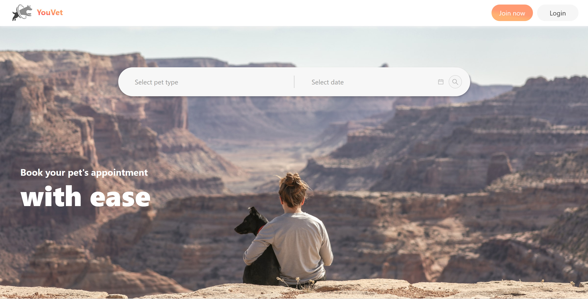

<!-- PROJECT LOGO -->
<br />
<p align="center">
  <a href="https://github.com/hcwtam/vet-booking/tree/master/web">
    
  </a>

  <h3 align="center">Vet Booking System (Front end)</h3>

  <p align="center">
    Front end application of Vet booking system for pet owners.
    <br />
    <br />
    <a href="https://vet-booking.netlify.app/">View Site</a>
    ·
    <a href="https://github.com/hcwtam/vet-booking/tree/master/web/issues">Report Bug</a>
    ·
    <a href="https://github.com/hcwtam/vet-booking/tree/master/web/issues">Request Feature</a>
  </p>
</p>

## Built With

- [React](https://reactjs.org/)
- [SWR](https://swr.vercel.app/)
- [Formik](https://formik.org/)
- [Ant Design](https://ant.design/)
- [styled-components](https://styled-components.com/)

<!-- GETTING STARTED -->

## Getting Started

To get a local copy up and running follow these simple steps.

### Prerequisites

- npm

```sh
npm install npm@latest -g
```

### Installation

1. Clone the repo

```sh
git clone https://github.com/hcwtam/vet-booking/tree/master/web
```

2. Install NPM packages

```sh
npm install
```

<!-- CONTACT -->

## Contact

Please feel free to contact me:

Email - [hcwtam@gmail.com](hcwtam@gmail.com)

Project Link: [https://github.com/hcwtam/vet-booking/tree/master/web](https://github.com/hcwtam/vet-booking/tree/master/web)
